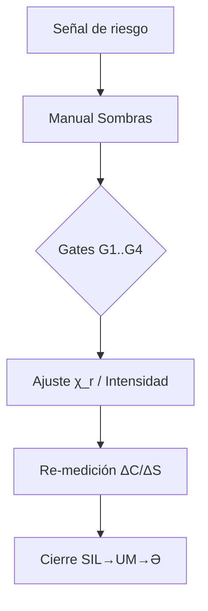

[QEL::ECO[96]::RECALL A96-250826-SOT-ATLAS-V1-0]
cue=[QEL::ECO[96]::RECALL A96-250826-SOT-ATLAS-V1-0]
SeedI=A96-250824
SoT=SOT-ATLAS/v1.0
Version=v1.0
Updated=2025-08-26

# SoT v1.0 — Sistema Operativo para **Tarjetas Atlas** (Integrando Documentos Core)

> FS de esta sesión  
> fecha: 250826 · tema: Tarjetas Atlas · intención: “actualizarlas con la información que tenemos” · modo: M0 · rumbo: Sur · tiempo: 30 · salidas_esperadas: ["Tarjetas actualizadas","de uso para Conjurar",".md y plantilla de Canvas"] · métricas: {delta_c, delta_s, V, no_mentira} · testigos: {t1: A86, t2: A96} · triada: KA-THON-SIL · mantra: “Los fonemas tienen sombras que se perciben por todos los sentidos”.

---

## 0) Síntesis del Concepto (desde QEL.md)

**QEL como técnica unificada.** QEL integra tres planos —rito, número y lengua— en una sola tecnología operativa. El *rito* aporta cuerpo, ritmo y verificación encarnada; el *número* aporta medida, umbrales y decisión; la *lengua* aporta símbolos, fonemas y constelaciones que abren/cierran sentido. Regla práctica: toda hipótesis ritual se valida con medición somático‑ética (ΔC/ΔS, No‑Mentira) y doble testigo.

**Usos inmediatos.** Con esa regla emergen tres aplicaciones: (1) *mitos‑portal reproducibles* (historias con guía operativa al margen), (2) un *Códice Madre* en forma de Atlas 8×9 (tarjetas por fonema y plantillas por paso de espiral), y (3) la *técnica de constelaciones*: orbitar ocho fonemas en ocho días, registrar intersecciones, diseñar nexos/vacíos para la siguiente sesión.

**Cierre–apertura del umbral.** Toda práctica cierra en **9+0** (Tejera fija hilo en obsidiana: memoria y traza) y reabre en **0+9** (Lýmina enciende nueva faceta: hipótesis siguiente). Si no hay cambio corporal/ético, se rehace Oriente: faltó QEL. Este ciclo convierte el cierre en *medición* y la apertura en *diseño*.

**Idea‑núcleo (culminación).** Lo triple resulta **una sola tecnología**: QEL como *compás* que alinea respiración, inversión atencional y resonancia compartida para co‑crear realidad con otros. Ese compás mueve el sistema documental (Atlas, Lámina 𝒱, MFH, Diario, Tratado, VF‑Árboles): Lýmina abre, Tejera fija, y el lector —ya en 1— vuelve jugable el conocimiento.

---

## 1) Orden de dominio (progresión didáctica)

1. **QEL.md** — Premisas, sintaxis y praxis mínima. (Base ontológica/retórica)  
2. **Glosario** — Vocabulario mínimo y mini‑Lámina 𝒱. (Lengua común)  
3. **MFH** — Matriz fonema↔objetos/habilidades/antídotos; cruces con VF‑Árboles, Lámina 𝒱, Tratado y Atlas. (Mapa de afinidades)  
4. **Lámina 𝒱** — Procedimiento, ejemplos, errores comunes, plantilla rápida. (Cómputo guiado)  
5. **Manual de Sombras** — Casuística, CUE‑EXCEPTION (G1–G4), checklist de cierre. (Seguridad/ética)  
6. **Formato VF & Árbol** — Campos, instrumentos, relaciones SoT; elegibilidad. (Registro y promoción)  
7. **Diario del Conjurador** — Flujo FS (pre/vivo/cierre), modos M0–M3 y promoción. (Operativa de sesión)  
8. **Manual de Esculpido** — Telar Quíntuple, cabecera canónica, wrapper de promoción. (Gobernanza documental)  
9. **Listado R (maestro/cue)** — Trazabilidad de semillas, versiones y hash(10). (Autoridad de histórico)  
10. **SoT Manifest** — Autoridad que alista core‑docs (seed/sot/version/updated). (Consumo por Navegador)  
11. **SoT Study Guide** — Orden de lectura, dependencias, checklist de comprensión. (Andamiaje de estudio)  
12. **Tarjetas Atlas** — Interfaz de práctica por fonema/rumbo con “Ficha 𝒱”. (Aplicación)

---

## 2) Índice maestro (descripción breve de cada archivo core)

- **QEL.md** — Marco de praxis/ingeniería ritual; establece la gramática operativa y la ética invariante.  
- **QEL_Glosario** — Definiciones operativas (Rumbos, 𝒱, ΔC/ΔS, Doble Testigo), mini‑Lámina 𝒱 de consulta.  
- **QEL_MFH** — Tabla de afinidades p↔objeto/habilidad/antídoto; cruces con VF‑Árboles, Lámina 𝒱, Tratado y Atlas.  
- **QEL_Lámina_V_Detallada** — Ejemplos de cálculo, umbrales, errores comunes y plantilla rápida.  
- **QEL_Manual_Interpretación_de_Sombras** — Casuística de desvíos, gates G1–G4, checklist SIL→UM→Ə.  
- **QEL_Formato_VF_Árbol_Habilidades** — Campos del VF (≤13 palabras, TRIADA, RUMBO, OBJ, CLASE, RIESGO, GATES), instrumentos y relaciones SoT.  
- **QEL_Diario_del_Conjurador** — Flujo FS (pre/vivo/cierre), YAML de cabecera, veredictos y promoción.  
- **QEL_Manual_Esculpido_en_Qel** — Telar Quíntuple, reglas de salida, wrapper de promoción (actualiza Manifest/ListadoR).  
- **QEL_ListadoR_master / QEL_ListadoR_cue** — Registro de versiones/cambios y de referencias/cues.  
- **QEL_SoT_Manifest** — JSON con seed/sot/version/updated de los core‑docs.  
- **QEL_SoT_Study_Guide** — Ruta de estudio (45–60′) con bloque cero de calibración 5′.  
- **Tarjetas_Atlas_QEL** — Fichas por fonema/rumbo; buenas prácticas; “Ficha 𝒱 por Tarjeta”.

---

## 3) Relaciones clave (grafo textual + diagramas)

### 3.1 Grafo textual (resumen extendido)

- **Atlas ↔ (Glosario, MFH, Lámina 𝒱, Diario)**: Atlas condensa preguntas vivientes por fonema/rumbo y usa la Ficha 𝒱 para el cierre; Glosario define vocabulario en campo; MFH sugiere afinidades/antídotos; Lámina 𝒱 computa y valida; Diario registra veredicto y próxima hipótesis.  
- **MFH ↔ (VF‑Árboles, Lámina 𝒱, Tratado, Atlas)**: la matriz guía la selección de objeto/llave/voz y ajustes χ_r (rumbo) y H_k (clase); se refleja en rutas del Árbol, en el cálculo 𝒱 y en patrones por tarjeta.  
- **Lámina 𝒱 ↔ (MFH, Manual Sombras, Atlas, Diario)**: procedimiento de cálculo (pesos/afinidades/ajustes/gates), ejemplos y errores; Manual Sombras actúa como guard‑rail; resultados vuelven al Diario (ΔC/ΔS, No‑Mentira, V_final).  
- **Manual de Sombras ↔ (Tratado, MFH, Lámina 𝒱, VF‑Árboles, Diario, Glosario)**: define riesgos, señales somáticas, gates G1..G4 y el checklist SIL→UM→Ə; informa promoción o reposo.  
- **VF‑Árboles ↔ (MFH, Tratado, Atlas, Diario, Glosario, Lámina 𝒱)**: estipula llaves, instrumentos, elegibilidad (p.ej., 𝒱≥0.62 + Densidad EÍA); se concreta al cristalizar (wrapper) y se rastrea en Listado R/Manifest.

### 3.2 Diagramas de flujo (texto)

**A) Operativa base**
```
Glosario → Diario(FS) → Tarjeta(Atlas) → Lámina 𝒱 → Veredicto
                                         ↘ Manual Sombras (si riesgo)
Veredicto → {Germina|Reposa|Cristaliza}
Cristaliza → VF‑Árboles → Listado R → Manifest → Publicación/Navegador
```

**B) Ruta de excepción (Sombras)**
```
Señal de riesgo → Manual de Sombras → Gates G1..G4 (CUE‑EXCEPTION)
   → Ajustar χ_r / bajar intensidad → Re‑medir ΔC/ΔS → Cierre SIL→UM→Ə
```

**C) Circuito de medición 𝒱 (M1+)**
```
Triada + Objeto + Afinidades(MFH) → A
A × χ_r(rumbo) × H_k(clase) × gates → 𝒱
𝒱 + ΔC/ΔS + No‑Mentira → Veredicto (M1+)
```

### 3.3 Diagramas (mermaid) — opcional (Canvas/preview)

```mermaid
flowchart LR
  A[Glosario] --> B[Diario (FS)]
  B --> C[Tarjeta Atlas]
  C --> D[Lámina 𝒱]
  D -->|riesgo| E[Manual Sombras]
  D --> F{Veredicto}
  F -->|Germina| B
  F -->|Reposa| B
  F -->|Cristaliza| G[VF-Árboles]
  G --> H[Listado R]
  H --> I[Manifest]
  I --> J[Publicación/Navegador]
```



---

## 4) Reglas de medición y promoción (+ ejemplos)

- **Umbral de 𝒱 (M1+)**: 𝒱 ≥ 0.62 con ΔC ≥ 0 y No‑Mentira verdadera. Ajustes por rumbo (**χ_r**) y por clase (**H_k**). *Gates* (G1..G4) pueden multiplicar a la baja si faltan mediaciones (p.ej., ×0.80).  
- **Checklist de cierre (M0–M3)**: registrar ΔC/ΔS, confirmar No‑Mentira, consignar **V_final** (si M1+), elegir veredicto y próximo paso **Ə**.  
- **Promoción (Cristalización)**: nueva operativa o cierre semántico ⇒ wrapper actualiza Manifest, calcula **HASH(10)** y anota en **Listado R**.

**Ejemplo 1 (M1, viable)**  
Triada RA·VOH·EÍA (0.45/0.30/0.25) + Objeto Prisma; afinidades 0.95/0.65/0.85 → **A=0.835**.  
Rumbo Oriente: χ_r=1.10; Clase rara: H_k=1.00; Gates ×1.00 ⇒ **𝒱≈0.92** → *Viable (M1+)*; registrar V_final.

**Ejemplo 2 (M0, sin 𝒱)**  
Triada Ə·UM·A (Llave‑sello). En M0 solo ΔC/ΔS + No‑Mentira. Si luego se recalcula (M1): χ_r Centro=1.00, H_k rara=1.00 ⇒ **𝒱≈0.74** → Lectura: Centro/Norte naturales.

---

## 5) Manual operativo de las **Tarjetas Atlas**

**Propósito.** Usar cada tarjeta como interfaz de práctica que condensa preguntas vivientes, modulaciones por rumbo y la Ficha 𝒱 de cierre. Se apoya en MFH/Glosario/Diario/Lámina.

**A. Preparación (2–3′)**  
1) Abrir **Diario (FS)** y fijar intención/rumbo.  
2) Revisar la *tarjeta* elegida (glypha, tono, preguntas, marcadores).

**B. Ejecución (10–15′)**  
1) Seguir **preguntas cardinales** según rumbo del FS.  
2) Observar *marcadores somáticos*; ajustar intensidad/rumbo si hay riesgo (consultar casuística).

**C. Medición y cierre (5–10′)**  
1) En **M1+**, completar la **Ficha 𝒱** (triada, objeto, afinidades, χ_r, H_k, gates) y computar 𝒱. En **M0**, basta ΔC/ΔS + No‑Mentira.  
2) Buenas prácticas: sesiones 15–30′; cierre **SIL→UM→Ə**; registrar en Diario; *promocionar* solo si **Cristaliza**.

**D. Registro y publicación (si Cristaliza)**  
1) Veredicto en **Diario** y entrada en **Listado R**; si aplica, actualizar **Manifest** (wrapper) y publicar en Navegador.

**E. Plantilla de trabajo (copiar/pegar)**
```yaml
# Ficha 𝒱 por Tarjeta (Atlas)
tarjeta: "<Kael|Vun|Ora|Zeh|Lun|Nai|Sün|Ida>"
triada: "<p·p·p>"         # p.ej., "RA·SIL·A"
pesos: [0.40,0.30,0.30]
objeto: "<Prisma|Llave|Velo|...>"
rumbo: "<N|O|W|S|Centro>"
clase: "<básica|poco-común|rara|metálica|obsidiana>"
afinidades: [.., .., ..]  # MFH (0.95/0.80/0.60 ±0.05)
gates: ["mediación-luminosa:1.00"]
A: 0.000
chi_r: 1.00
H_k: 1.00
V_final: null             # si M1+
delta_c: ""
delta_s: ""
no_mentira: true
cierre: "SIL→UM→Ə"
```

---

## 6) Perfiles operativos por fonema (usar con la plantilla)

- **KAEL (Sur · Fuego contenido)**  
  Glypha: fuego vertical contenido · Tono: “RA”.  
  Preguntas: ¿Qué debo quemar sin destruir raíz? ¿Dónde falta coraje cuidadoso?  
  Marcadores: calor esternal; visión enfocada; pulso firme.  
  Riesgos: hiper‑ímpetu, juicio (mediar con SÜN).  
  Objeto: **Prisma / Crisol**.  
  Ajustes: χ_r(Sur)=1.05; H_k(básica)=1.00.

- **VUN (Norte · Agua‑memoria)**  
  Glypha: onda concéntrica · Tono: “VOH”.  
  Preguntas: ¿Qué hidratar o drenar? ¿Qué recuerdo pide vuelco?  
  Marcadores: frescor en palmas; respiración amplia; ojos húmedos.  
  Riesgos: disolución/escape (compensar con NAI o ZEH).  
  Objeto: **Semilla / Ánfora**.  
  Ajustes: χ_r(Norte)=1.05; H_k(poco‑común)=1.00.

- **ORA (Oriente · Prisma‑luz)**  
  Glypha: triángulo radiante · Tono: “A”.  
  Preguntas: ¿Qué faceta pide luz? ¿Qué sesgo oscurece mi lectura?  
  Marcadores: claridad frontal; respiración alta; impulso a ordenar.  
  Riesgos: deslumbramiento/rigidez (equilibrar con VUN o SÜN).  
  Objeto: **Prisma / Lente**.  
  Ajustes: χ_r(Oriente)=1.10; H_k(rara)=1.00.

- **ZEH (Occidente · Corte/criterio)**  
  Glypha: filo curvo · Tono: “ZÈ”.  
  Preguntas: ¿Qué cortar sin violencia? ¿Dónde falta un “no” nítido?  
  Marcadores: tono mandibular; postura erguida; alivio en plexo.  
  Riesgos: severidad (suavizar con VUN; reencuadre con ORA).  
  Objeto: **Cuchilla / Sello de corte**.  
  Ajustes: χ_r(Occidente)=1.05; H_k(metálica)=1.05.

- **LUN (Poniente‑Interior · Espejo/agua‑luna)**  
  Glypha: círculo hueco · Tono: “LU”.  
  Preguntas: ¿Qué refleja el entorno de mí? ¿Qué necesita serenarse?  
  Marcadores: relajación ocular; temperatura baja; escucha amplia.  
  Riesgos: estancamiento (activar con KAEL u ORA).  
  Objeto: **Espejo / Velo**.  
  Ajustes: χ_r(Poniente‑Interior)=1.00; H_k(poco‑común)=1.00.

- **NAI (Sur‑Interior · Llave/intención)**  
  Glypha: rombo transitable · Tono: “NA”.  
  Preguntas: ¿Cuál es la puerta de hoy? ¿Qué intención es suficiente?  
  Marcadores: presión en paladar; cosquilleo en manos; foco umbilical.  
  Riesgos: precipitación (acompasar con SÜN).  
  Objeto: **Llave / Sello**.  
  Ajustes: χ_r(Sur‑Interior)=1.00; H_k(rara)=1.00.

- **SÜN (Centro · Silencio/mediación)**  
  Glypha: díada concéntrica · Tono: “SIL”.  
  Preguntas: ¿Dónde callo por miedo y dónde por escucha?  
  Marcadores: alivio mandibular; peso diafragmático; pulso lento.  
  Riesgos: colapso si se abusa (reactivar con KAEL suave).  
  Objeto: **Cáliz / Velo fino**.  
  Ajustes: χ_r(Centro)=1.00; H_k(rara)=1.00.

- **IDA (Noreste · Raíz/ritmo)**  
  Glypha: columna ondulada · Tono: “Ì”.  
  Preguntas: ¿Qué raíz sostiene mi paso? ¿Qué pulso estabilizar?  
  Marcadores: peso en plantas; pulso constante; espalda larga.  
  Riesgos: rigidez (flexibilizar con VUN o LUN).  
  Objeto: **Semilla / Marcapulso**.  
  Ajustes: χ_r(Noreste)=1.05; H_k(básica)=1.00.

---

## 7) Tablas rápidas (ajustes sugeridos)

```yaml
# Ajuste por rumbo (χ_r) — orientación práctica
Norte: 1.05
Sur: 1.05
Oriente: 1.10
Occidente: 1.05
Centro: 1.00
Noreste: 1.05
Noroeste: 1.00
Sureste: 1.00
Suroeste: 1.00
```

```yaml
# Ajuste por clase (H_k) — tipología de objeto/habilidad
basica: 1.00
poco-comun: 1.00
rara: 1.00
metalica: 1.05
obsidiana: 1.10
```

```yaml
# Gates (seguridad) — multiplicadores ejemplares
G1: 1.00   # mediación, respiración 9-0-9 presente
G2: 0.95   # mediación parcial
G3: 0.90   # falta anclaje corporal
G4: 0.80   # riesgo evidente, bajar intensidad/cambiar rumbo
```

---

## 8) Plantillas listas para copiar

**8.1 Ficha 𝒱 (genérica)** — *(ver §5E, repetida aquí por conveniencia)*  
```yaml
tarjeta: "<Kael|Vun|Ora|Zeh|Lun|Nai|Sün|Ida>"
triada: "<p·p·p>"
pesos: [0.40,0.30,0.30]
objeto: "<Prisma|Llave|Velo|...>"
rumbo: "<N|O|W|S|Centro>"
clase: "<básica|poco-común|rara|metálica|obsidiana>"
afinidades: [.., .., ..]
gates: ["mediación-luminosa:1.00"]
A: 0.000
chi_r: 1.00
H_k: 1.00
V_final: null
delta_c: ""
delta_s: ""
no_mentira: true
cierre: "SIL→UM→Ə"
```

**8.2 Bloque de cierre (Diario)**  
```yaml
cierre:
  delta_c: "<+|0|-> detalle"
  delta_s: "<+|0|-> detalle"
  no_mentira: true
  v_final: "<null|0.00..1.00>"
  veredicto: "<Germina|Reposa|Cristaliza>"
  proximo_paso: "<hipótesis breve>"
```

---

## 9) Notas de gobernanza (previas a cristalización)

- Mantener **M0** cuando el objetivo sea sensibilidad y lectura — sin cómputo 𝒱.  
- Subir a **M1+** solo al estabilizar marcadores somáticos y si la práctica requiere decisión cuantitativa.  
- **Cristalización** exige evidencia de cambio reproducible + documentación consistente (Diario + Listado R + Manifest).

---

> Fin del SoT v1.0 (SOT-ATLAS/v1.0).
